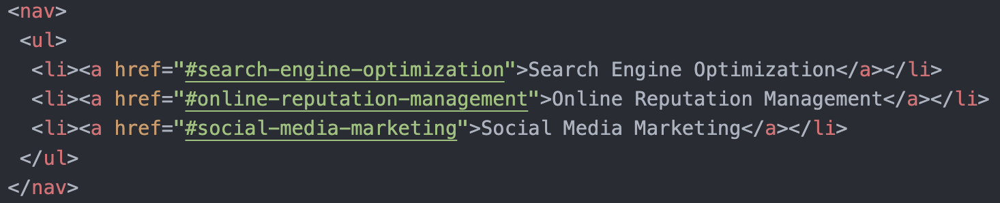
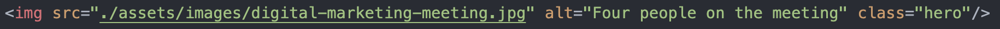
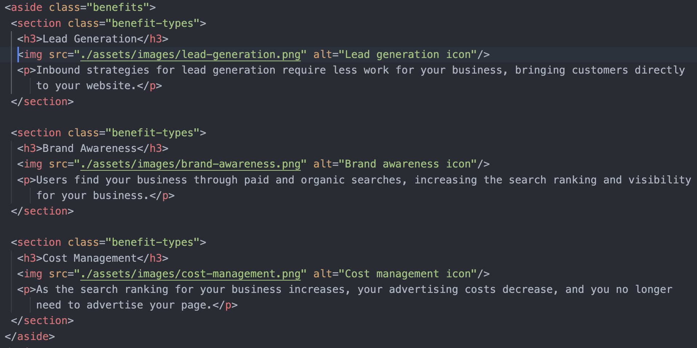
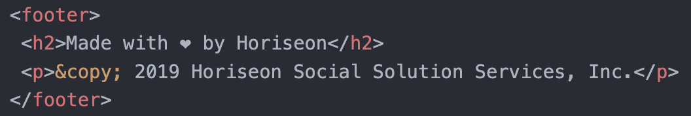

# Horiseon Accessibility Project

## Description

This repository was created by a Bootcamp Front-End student, as a part of the challenge of Module 1. In the beginning of the challenge I had a starter code that had to be changed in a semantic way without changing the looks of the given cite. 

The process of changing this code allowed me to learn about the semantic HTML elements and helped make the starter code accessible. For example, i used many different semantic HTML elements such as: 

- **nav element**

- **alt atribute**

- **aside** and **section elements**

- **footer element** 
  

Also, was deleted and changed some CSS classes, and organized CSS structure, that helped to reduce repetition. As a result, we can see a site that is optimized for search engines, semantic structured, organized, clean and easy to read.

## Installation

“N/A” 

## Usage

To use this Horiseon Accessibility Project, you can review the code, and compare starter code with the main branch to see the difference between them. Also be free to open the Chrome DevTools by pressing Command+Option+I (macOS) or Control+Shift+I (Windows),where you can use console pannel to navigate through the code.

You can find deployed application by following this link [https://ivanna0803.github.io/module-1-horiseon-accessibility/]

## Credits

“N/A”

## License

 MIT license

